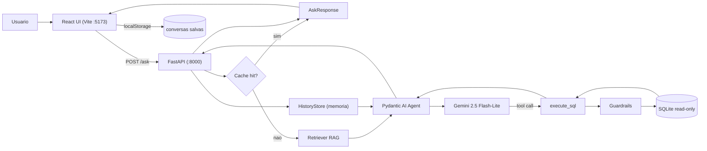

<div align="center">

# Agente E-commerce GenAI

**Text-to-SQL conversacional com Gemini 2.5, RAG local e UI React.**

Um agente de IA que recebe perguntas em português sobre um banco de e-commerce
brasileiro, gera SQL, executa no SQLite (read-only) e devolve dados, gráficos
e uma explicação em linguagem natural.

[](https://www.python.org/)
[](https://www.typescriptlang.org/)
[](https://fastapi.tiangolo.com/)
[](https://react.dev/)
[](https://vitejs.dev/)
[](https://tailwindcss.com/)
[](https://ai.pydantic.dev/)
[](https://ai.google.dev/)
[](https://www.sqlite.org/)
[](#licença)

</div>

---

## Sumário

1. [O que é este projeto?](#1-o-que-é-este-projeto)
2. [Stack e por que cada tecnologia](#2-stack-e-por-que-cada-tecnologia)
3. [Arquitetura](#3-arquitetura)
4. [Estrutura de pastas](#4-estrutura-de-pastas)
5. [Funcionalidades](#5-funcionalidades)
6. [Cobertura do enunciado](#6-cobertura-do-enunciado)
7. [Pré-requisitos](#7-pré-requisitos)
8. [Passo a passo de execução](#8-passo-a-passo-de-execução)
9. [Avaliação automática](#9-avaliação-automática)
10. [Documentação complementar](#10-documentação-complementar)
11. [Limitações conhecidas](#11-limitações-conhecidas)
12. [Créditos e licença](#12-créditos-e-licença)

---

## 1) O que é este projeto?

**Problema.** Um banco SQLite de e-commerce brasileiro tem 7 tabelas e
~99 mil pedidos. Pessoas de negócio querem responder perguntas como
*"quais os 10 produtos mais vendidos?"* ou *"qual estado tem maior atraso nas
entregas?"* sem escrever SQL.

**Solução.** Este projeto é um **agente conversacional** que:

- Recebe a pergunta em **PT-BR** no chat.
- Usa **Gemini 2.5 Flash-Lite** via **Pydantic AI** para gerar a SQL apropriada.
- Valida a query em **5 camadas de guardrails** (só leitura, sem DDL/DML,
  LIMIT obrigatório no nível externo).
- Executa no **SQLite em modo read-only** e devolve os dados.
- Renderiza no frontend uma **bolha** com a explicação, um **bloco SQL
  colapsável** (e editável), uma **tabela** e, quando faz sentido, um
  **gráfico automático**.

**Objetivo.** Cobrir as 5 categorias de análise da atividade — Vendas,
Logística, Satisfação, Consumidores e Vendedores/Produtos — com pelo menos
as 10 perguntas canônicas do enunciado.

**Vantagens sobre "só um BI":**
- Conversa com **follow-ups** ("e filtrando por SP?") preservando o
  contexto.
- **Gráficos automáticos** (Bar/Line/Pie) quando o resultado é agregado.
- **Edição manual da SQL** para ajustes sem gastar nova chamada ao LLM.
- **Export** em Markdown (conversa inteira) e CSV (tabela de resultados).
- **Cache** de respostas repetidas por conversa (zero token gasto no hit).

---

## 2) Stack e por que cada tecnologia

| Tecnologia | Papel | Justificativa |
|---|---|---|
| **Python 3.11** | Linguagem do backend | Exigida pelo enunciado; vasto ecossistema de IA. |
| **FastAPI 0.115** | Servidor HTTP | Async nativo, Pydantic integrado, Swagger automático em `/docs`, CORS em uma linha. |
| **Pydantic AI** | Framework de agente | Type-safe, tool calling com validação automática, suporte nativo ao Gemini, muito menos boilerplate que LangChain. |
| **Gemini 2.5 Flash-Lite** | LLM | Permitido pelo enunciado (Flash ou Flash-Lite); é o mais leve da família Gemini 2.5 — menor custo e menor latência, suficiente para Text-to-SQL quando recebe schema bem anotado no prompt. |
| **SQLite (read-only URI)** | Banco de dados | Arquivo único (`banco.db`), sem servidor; modo `file:...?mode=ro` garante imutabilidade mesmo se algum guardrail falhar. |
| **fastembed (ONNX)** | RAG local | MiniLM multilíngue via ONNX Runtime (~200 MB) em vez de `torch` (~1.2 GB). Seleciona só as tabelas relevantes do schema e economiza 30-60% dos tokens do system prompt. Fallback automático para BM25 puro-Python. |
| **uvicorn** | ASGI server | Servidor async padrão do FastAPI, com hot-reload em dev. |
| **requests** | Cliente HTTP | Usado apenas pelo script de avaliação (`eval/run_eval.py`) para bater no próprio backend. |
| **React 19 + Vite 8** | UI | React é o mais popular; Vite dá HMR instantâneo (~200ms) e build moderno. |
| **TypeScript 6 (estrito)** | Tipagem do frontend | Zero `any` no código. Detecta bugs em build. |
| **Tailwind CSS 3** | Estilização | Utility-first, permite UI polida sem CSS proprietário, dark mode via classe. |
| **recharts 3** | Gráficos | API declarativa sobre React; Bar/Line/Pie prontos e responsivos. |
| **uuid** | IDs únicos | `conversation_id` e `message.id` gerados no cliente. |
| **pnpm 10** | Package manager | Cache eficiente; economiza ~70% de disco comparado a `npm`. |

**Nada de Redux / zustand / react-query.** O estado do chat é local, cache
fica no `localStorage`, não há complexidade que justifique bibliotecas
extras de estado global.

---

## 3) Arquitetura



**Resumo do fluxo:**

1. Usuário digita uma pergunta na UI React.
2. Frontend faz `POST /ask` para o FastAPI com `conversation_id`.
3. Backend checa cache local; se hit, devolve sem chamar o LLM.
4. Retriever RAG escolhe quais das 7 tabelas do schema entram no prompt.
5. Pydantic AI monta prompt (schema reduzido + histórico da conversa) e
   envia ao Gemini.
6. Gemini decide chamar a tool `execute_sql`; guardrails validam a query;
   SQLite executa em modo read-only.
7. Backend devolve `AskResponse` com `sql`, `columns`, `rows`, `explanation`,
   `suggestions` e metadados do RAG.
8. Frontend renderiza bolha, bloco SQL, tabela, gráfico, sugestões de
   follow-up, e persiste a conversa no `localStorage`.

---

## 4) Estrutura de pastas

```
Atividade-GenAI/
├── backend/
│   ├── app/
│   │   ├── __init__.py
│   │   ├── main.py              # FastAPI + rotas + lifespan
│   │   ├── agent.py             # Pydantic AI + SYSTEM_PROMPT + tool execute_sql
│   │   ├── tools.py             # run_query (usado pela tool)
│   │   ├── guardrails.py        # validacao de SQL
│   │   ├── db.py                # conexao SQLite read-only + .env
│   │   ├── schema.py            # SCHEMA_STR + build_schema_section
│   │   ├── schema_inspector.py  # introspeccao ao vivo do SQLite
│   │   ├── retriever.py         # RAG local (fastembed + BM25)
│   │   ├── history.py           # HistoryStore + cache de respostas
│   │   └── models.py            # Pydantic schemas da API
│   ├── eval/
│   │   ├── __init__.py
│   │   ├── questions.py         # 10 perguntas canonicas
│   │   ├── run_eval.py          # executor da bateria
│   │   └── eval_report.md       # relatorio (versionado)
│   ├── banco.db                 # SQLite do marketplace (~63 MB)
│   ├── .env.example
│   ├── requirements.txt
│   └── ExplicacaoBackend.md     # guia detalhado do backend
├── frontend/
│   ├── src/
│   │   ├── main.tsx
│   │   ├── App.tsx
│   │   ├── index.css
│   │   ├── pages/
│   │   │   └── ChatPage.tsx
│   │   ├── components/
│   │   │   ├── atoms/           # Badge, Button, IconButton, Logo, ModelBadge, Spinner, ThemeToggle
│   │   │   ├── molecules/       # CategoryCard, ConversationItem, ErrorBanner, LoadingDots, SchemaMiniMap, ShortcutsModal, SuggestionChips
│   │   │   ├── organisms/       # ChartPanel, ChatInput, ExampleQuestions, Header, MessageBubble, MessageList, ResultTable, SchemaExplorer, Sidebar, SQLBlock
│   │   │   └── templates/
│   │   │       └── ChatLayout.tsx
│   │   ├── hooks/               # useChat, useConversations, useHealth, useHotkeys, useTheme
│   │   ├── services/            # api.ts, storage.ts
│   │   ├── lib/                 # csv.ts, dateGroups.ts, markdown.ts
│   │   └── types/
│   │       └── index.ts
│   ├── public/                  # favicon.svg, icons.svg
│   ├── index.html
│   ├── package.json
│   ├── pnpm-lock.yaml
│   ├── tailwind.config.js
│   ├── postcss.config.js
│   ├── eslint.config.js
│   ├── vite.config.ts
│   ├── tsconfig.json
│   ├── tsconfig.app.json
│   ├── tsconfig.node.json
│   ├── README.md
│   └── ExplicacaoFrontend.md    # guia detalhado do frontend
├── .gitignore
└── README.md                    # este arquivo
```

**Convenção do frontend: Atomic Design.** `atoms → molecules → organisms
→ templates → pages`. Estado mora em `pages` e `hooks`; components
renderizam e recebem callbacks.

---

## 5) Funcionalidades

### Core

- **Chat conversacional** com follow-ups preservando contexto da conversa.
- **Geração e execução de SQL** a partir de pergunta em PT-BR.
- **Guardrails de 5 camadas**: não vazio, 1 único statement, sem DML/DDL,
  começa com `SELECT`/`WITH`, LIMIT no nível externo. Camada dura extra:
  `fetchmany(1000)` sempre.
- **Schema injetado dinamicamente** no system prompt via RAG (só as tabelas
  relevantes para a pergunta).

### UX e produtividade

- **Histórico de conversas** persistido no `localStorage` (até 50), com
  busca, renomear (duplo clique), excluir e export em Markdown.
- **Schema Explorer** com introspecção ao vivo: linhas por tabela,
  colunas (tipo/PK/NOT NULL), top-5 categóricas em barras, min/avg/max
  numéricos, amostras e FKs lógicas clicáveis.
- **SchemaMiniMap RAG** na resposta: mostra quais tabelas o retriever
  escolheu e quantos tokens foram economizados.
- **SQL editável** no próprio chat: usuário ajusta a query e reexecuta via
  `POST /execute-sql`, sem gastar nova chamada ao Gemini.
- **Gráficos automáticos** (Bar, Line, Pie) quando o resultado é 2 colunas
  e a 2ª é ≥ 80% numérica.
- **Download CSV** das tabelas (UTF-8 com BOM para abrir direto no Excel).
- **Export em Markdown** da conversa inteira (título, SQL, tabela, linhas).
- **Dark mode** com persistência + respeito ao `prefers-color-scheme` do
  SO.
- **5 atalhos de teclado**: `Ctrl+B` (sidebar), `Ctrl+/` (nova conversa),
  `Ctrl+K` (Schema Explorer), `?` (atalhos), `Esc` (fechar).
- **Sugestões de follow-up** geradas pelo próprio LLM (até 3 por resposta).

### Operação

- **Cache de respostas** por `(conversation_id, pergunta_normalizada)`:
  zero chamada ao LLM em perguntas repetidas.
- **Rehydrate** de conversas antigas: backend repopula memória a partir do
  JSON salvo no cliente, sem gastar tokens.
- **Healthcheck** (`GET /health`) expõe modelo em uso, contadores e um
  `SchemaSnapshot` introspectado.
- **Bateria de avaliação automatizada** (`python -m eval.run_eval`) gera
  `eval/eval_report.md` com a taxa de sucesso das 10 perguntas canônicas.

---

## 6) Cobertura do enunciado

| Categoria da atividade | Perguntas canônicas |
|---|---|
| **Vendas e Receita** | Top 10 produtos mais vendidos; Receita total por categoria de produto |
| **Entrega e Logística** | Quantidade de pedidos por status; Percentual de pedidos entregues no prazo por estado |
| **Satisfação e Avaliações** | Média de avaliação geral dos pedidos; Top 10 vendedores por média de avaliação |
| **Consumidores** | Estados com maior volume + maior ticket médio; Estados com maior atraso nas entregas |
| **Vendedores e Produtos** | Top 5 produtos mais vendidos por estado; Categorias com maior taxa de avaliação negativa |

> **Cobertura medida:** 10/10 perguntas passam no eval automatizado — 100%
> de sucesso (HTTP 200 + SQL válida + ≥ 1 linha). Ver
> [backend/eval/eval_report.md](backend/eval/eval_report.md) para o
> relatório completo com SQL gerada, colunas retornadas e tempo por
> pergunta.

---

## 7) Pré-requisitos

| Ferramenta | Versão mínima | Como verificar |
|---|---|---|
| Python | 3.11 | `python --version` |
| Node.js | 18 | `node --version` |
| pnpm | 8 | `pnpm --version` |
| Git | qualquer | `git --version` |
| Chave Gemini | free tier OK | https://aistudio.google.com/apikey |

> **Nota sobre `banco.db`.** O arquivo vem versionado junto do repositório
> (~63 MB). Se for publicar no GitHub, configure **Git LFS** para evitar
> o limite de 100 MB por arquivo:
>
> ```powershell
> git lfs install
> git lfs track "backend/banco.db"
> git add .gitattributes
> ```

---

## 8) Passo a passo de execução

Comandos escritos para **Windows PowerShell**. No Mac/Linux, troque
`.\venv\Scripts\Activate.ps1` por `source venv/bin/activate`.

### 8.1) Clonar o repositório

```powershell
git clone <url-do-repo>
cd Atividade-GenAI
```

> Se clonou com Git LFS, rode `git lfs pull` para baixar o `banco.db`.

### 8.2) Setup do backend (primeira vez)

```powershell
cd backend
python -m venv venv
.\venv\Scripts\Activate.ps1
pip install -r requirements.txt
Copy-Item .env.example .env
```

Abra `backend\.env` e preencha sua chave Gemini:

```
GEMINI_API_KEY=AIza...sua_chave_aqui
DB_PATH=./banco.db
MODEL=google-gla:gemini-2.5-flash-lite
```

> **Atenção — API key.** Se a chave vazar (screenshot, PR, etc), revogue e
> gere outra em https://aistudio.google.com/apikey. O `.gitignore` já
> exclui `.env` do versionamento.

### 8.3) Rodar o backend

Com a venv ativada:

```powershell
python -m uvicorn app.main:app --port 8000 --reload
```

Você deve ver:

```
INFO:     Uvicorn running on http://127.0.0.1:8000
INFO:     Application startup complete.
```

Em outro terminal, confira que está no ar:

```powershell
curl.exe http://127.0.0.1:8000/health
```

### 8.4) Setup do frontend (em outro terminal)

```powershell
cd Atividade-GenAI\frontend
pnpm install
```

### 8.5) Rodar o frontend

```powershell
pnpm dev
```

Saída esperada:

```
VITE v8.0.9  ready in 267 ms
➜  Local:   http://127.0.0.1:5173/
```

### 8.6) Usar o agente

Abra no navegador: **http://127.0.0.1:5173**

Clique em uma das 10 perguntas de exemplo ou digite a sua. Faça
follow-ups na mesma conversa ("e em 2018?", "e filtrando por SP?",
"mostre o top 20").

### 8.7) Troubleshooting

| Problema | Solução |
|---|---|
| `execucao de scripts desativada` (ao ativar venv) | `Set-ExecutionPolicy -Scope CurrentUser -ExecutionPolicy RemoteSigned` uma vez |
| `WinError 10013` na porta 8000 | Rode `uvicorn` com `--port 8001` e defina `VITE_API_BASE=http://127.0.0.1:8001` antes de `pnpm dev` |
| `Banco nao encontrado em ...` | Verifique que `backend/banco.db` existe; se usou Git LFS, `git lfs pull` |
| `ModuleNotFoundError: requests` | `pip install -r requirements.txt` de novo (venv ativa) |
| 503 UNAVAILABLE do Gemini | Quota free tier atingida (20 req/dia); aguarde reset ou rotacione a chave |

---

## 9) Avaliação automática

Com o backend rodando em `http://127.0.0.1:8000`, em outro terminal:

```powershell
cd Atividade-GenAI\backend
.\venv\Scripts\Activate.ps1
python -m eval.run_eval
```

O script executa as 10 perguntas em batches de 2 com 60s entre batches
(respeitando os 5 RPM do free tier do Gemini) e gera
`backend/eval/eval_report.md` com:

- Taxa de sucesso geral e por categoria.
- HTTP status, número de linhas retornadas, tempo e colunas por
  pergunta.
- SQL gerada em cada resposta (truncada em 800 caracteres).
- Explicação do agente.

Tempo total: ~5 minutos.

---

## 10) Documentação complementar

Para mergulhar no código:

| Guia | Conteúdo |
|---|---|
| [backend/ExplicacaoBackend.md](backend/ExplicacaoBackend.md) | 9 seções sobre o backend: visão geral, anatomia, fluxo de uma pergunta, cada módulo (main, agent, tools, guardrails, db, schema, schema_inspector, retriever, history, models, eval), endpoints, decisões de arquitetura, segurança, observabilidade, como estender. |
| [frontend/ExplicacaoFrontend.md](frontend/ExplicacaoFrontend.md) | 9 seções sobre o frontend: stack, Atomic Design, fluxo de uma pergunta (UI), cada componente (7 atoms, 7 molecules, 10 organisms, 1 template), hooks/services/lib/types/pages, estado + persistência, UX, como estender. |
| [backend/eval/eval_report.md](backend/eval/eval_report.md) | Último relatório da bateria de 10 perguntas (gerado automaticamente). |
| [frontend/README.md](frontend/README.md) | Scripts do frontend e links rápidos. |

---

## 11) Limitações conhecidas

- **Histórico em memória do uvicorn.** Se o backend reinicia, as conversas
  em memória somem. O `localStorage` do cliente sobrevive, e o endpoint
  `/rehydrate` restaura o contexto — mas follow-ups feitos nesse intervalo
  podem perder contexto se o cliente não reidratar antes.
- **Free tier do Gemini.** 5 RPM e ~20 requisições/dia por projeto. Cada
  pergunta no `/ask` consome 2 chamadas; a bateria de eval queima
  praticamente a cota diária.
- **Falso positivo raro em guardrails.** A regex que bloqueia DML/DDL
  considera palavras reservadas mesmo dentro de literais string (ex:
  `WHERE nome = 'DROP'` é rejeitado). Compromisso consciente: relaxar
  exigiria um parser SQL completo; o risco de uma brecha compensa o
  inconveniente raro.
- **Chart só com 2 colunas numéricas.** Quando o resultado tem mais
  dimensões, o `ChartPanel` não renderiza nada. A tabela e o CSV
  continuam disponíveis.
- **Cache por texto exato.** Se o usuário repetir exatamente a mesma
  pergunta em outra conversa, o cache não bate (a chave inclui o
  `conversation_id`). Intencional para manter histórico correto.

---

## 12) Créditos e licença

- **Base de dados.** Fornecida pela atividade (**Visagio | Rocket Lab 2026**).
  Contém dados históricos de um marketplace brasileiro entre 2016-2018.
- **Desenvolvimento.** Silvio Fittipaldi, 2026.
- **Licença.** MIT — veja `LICENSE` (ou adicione um se for publicar).

<div align="center">

---


</div>
