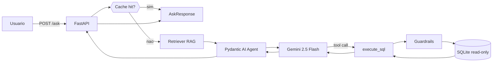
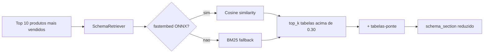
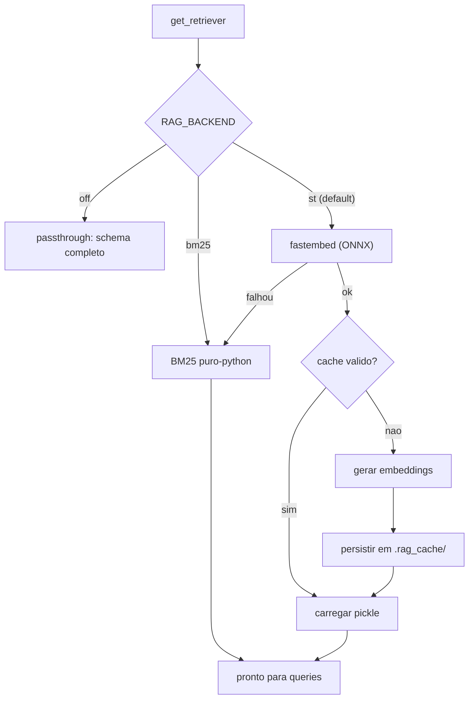
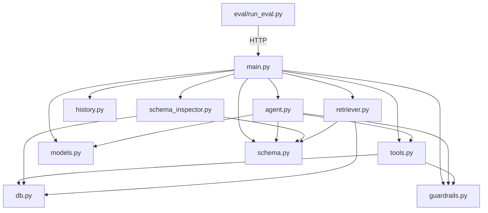

# Explicação Detalhada do Backend

> Guia pedagógico para entender cada pasta e arquivo do backend **sem precisar
> abrir o código**. Cada seção explica o propósito, o que tem dentro, como
> interage com as outras partes, e como testar isoladamente.

---

## Sumário

1. [Visão geral em 30 segundos](#1-visão-geral-em-30-segundos)
2. [Anatomia do projeto](#2-anatomia-do-projeto)
3. [Fluxo de uma pergunta, passo a passo](#3-fluxo-de-uma-pergunta-passo-a-passo)
4. [Módulos um a um](#4-módulos-um-a-um)
5. [Endpoints da API](#5-endpoints-da-api)
6. [Decisões de arquitetura](#6-decisões-de-arquitetura)
7. [Segurança](#7-segurança)
8. [Observabilidade](#8-observabilidade)
9. [Como estender](#9-como-estender)

---

## 1) Visão geral em 30 segundos

O backend é uma API HTTP em **FastAPI** que recebe perguntas em português via
`POST /ask`, usa um **agente Pydantic AI + Gemini 2.5** para gerar SQL,
executa a query no **SQLite** em modo read-only e devolve os dados junto com
uma explicação em linguagem natural. Um **retriever RAG local** seleciona só
as tabelas relevantes do schema antes de chamar o LLM para economizar tokens.



---

## 2) Anatomia do projeto

```
Atividade-GenAI/backend/
├── app/                        # codigo principal da API
│   ├── __init__.py
│   ├── main.py                 # FastAPI + rotas + lifespan
│   ├── agent.py                # Pydantic AI + SYSTEM_PROMPT + tool execute_sql
│   ├── tools.py                # implementacao de run_query (usado pela tool)
│   ├── guardrails.py           # validacao de SQL (SELECT/WITH + LIMIT + 1 stmt)
│   ├── db.py                   # conexao SQLite read-only + carregamento do .env
│   ├── schema.py               # SCHEMA_STR (texto) + build_schema_section
│   ├── schema_inspector.py     # introspeccao ao vivo para o Schema Explorer
│   ├── retriever.py            # RAG local: fastembed (ONNX) ou BM25
│   ├── history.py              # HistoryStore em memoria + cache de respostas
│   └── models.py               # Pydantic schemas de request/response
├── eval/                       # bateria de avaliacao
│   ├── questions.py            # 10 perguntas canonicas
│   ├── run_eval.py             # roda as perguntas e gera eval_report.md
│   └── eval_report.md          # relatorio versionado (entregavel)
├── .env                        # GEMINI_API_KEY, DB_PATH, MODEL, RAG_BACKEND
├── .env.example                # template publico
├── banco.db                    # SQLite do marketplace (~63 MB)
└── requirements.txt
```

> **Nota:** `.rag_cache/` e `__pycache__/` aparecem após o primeiro run e são
> ignorados pelo git.

---

## 3) Fluxo de uma pergunta, passo a passo

Vamos seguir **"Top 10 produtos mais vendidos"** do navegador até a resposta.

### Passo 1 — Frontend envia o POST

O React em `frontend/src/App.tsx` monta o payload e dispara:

```json
POST http://127.0.0.1:8000/ask
{
  "question": "Top 10 produtos mais vendidos",
  "conversation_id": "e9a3aa05-cf99-4c54-9661-6ab87cafc2db"
}
```

### Passo 2 — FastAPI valida o payload

O FastAPI usa o Pydantic para garantir que `question` tem pelo menos 1
caractere e que `conversation_id` é string. Se passar, chama o handler
`ask(req)` definido em [main.py](Atividade-GenAI/backend/app/main.py).

```146:156:Atividade-GenAI/backend/app/main.py
@app.post("/ask", response_model=AskResponse)
async def ask(req: AskRequest) -> AskResponse:
    cached = store.cache_get(req.conversation_id, req.question)
    if cached is not None:
        logger.info(
            "Ask CACHE HIT conv=%s question=%r",
            req.conversation_id,
            req.question[:120],
        )
        return cached.model_copy(update={"cached": True})
```

### Passo 3 — Checa o cache in-memory

Se a mesma pergunta (normalizada: lowercase + espaços colapsados) já foi
respondida nesta conversa, devolve a resposta anterior com `cached=true`.
**Zero chamadas ao Gemini** nesse caminho.

### Passo 4 — RAG seleciona as tabelas relevantes

Se não houve cache hit, chama o retriever:



Para a pergunta acima, o retriever costuma escolher
`fat_itens_pedidos`, `dim_produtos` + a ponte `fat_pedidos`, economizando
~2400 tokens no prompt.

### Passo 5 — Monta as dependências do agente

```python
deps = AgentDeps(
    schema_section=schema_section,
    retrieved_tables=[...]
)
history = store.get(conversation_id)
```

`AgentDeps` é um **bloco de notas mutável** compartilhado com a tool. O LLM
só vai escrever a explicação final; colunas e linhas completas ficam aqui
para montarmos a `AskResponse` sem transportar dados pelo LLM (tokens caros).

### Passo 6 — Executa o agente

```185:190:Atividade-GenAI/backend/app/main.py
    try:
        result = await agent.run(
            req.question,
            deps=deps,
            message_history=history,
        )
```

Dentro de `agent.run`, o Pydantic AI:

1. Monta o system prompt dinâmico (cabeçalho estático + `schema_section`).
2. Envia ao Gemini: system + `history` + nova pergunta.
3. Gemini responde "quero chamar `execute_sql` com query=SELECT ...".
4. Pydantic AI roteia a chamada à nossa função `@agent.tool execute_sql`.
5. `execute_sql` → `run_query` → **guardrails** → SQLite → 1000 linhas no
   máximo via `fetchmany`.
6. Preview (10 linhas) volta ao Gemini.
7. Gemini gera a explicação final + até 3 sugestões de follow-up.

### Passo 7 — Monta e retorna a `AskResponse`

```224:240:Atividade-GenAI/backend/app/main.py
    response = AskResponse(
        sql=deps.last_sql or "",
        columns=deps.last_columns,
        rows=deps.last_rows,
        explanation=out.explanation,
        row_count=len(deps.last_rows),
        suggestions=out.suggestions,
        cached=False,
        messages_json=messages_json,
        retrieved_tables=list(retrieval.tables) if retrieval else list(TABLE_NAMES),
        used_full_schema=retrieval.used_full_schema if retrieval else True,
        tokens_saved_estimate=(
            retrieval.tokens_saved_estimate if retrieval else 0
        ),
    )
    store.cache_set(req.conversation_id, req.question, response)
    return response
```

Também:
- Salva o histórico atualizado em `store.set`.
- Salva a resposta no cache para futuras perguntas idênticas.
- Serializa as mensagens em `messages_json` para o sidebar do frontend e
  para poder reidratar conversas via `POST /rehydrate`.

---

## 4) Módulos um a um

### 4.1 `app/main.py` — A porta de entrada HTTP

**Propósito:** expor os endpoints, orquestrar cache + RAG + agente, tratar
erros amigáveis.

**O que tem dentro:**
- `lifespan`: roda no startup. Gera o `SchemaSnapshot` (via
  `inspect_database`) e aquece o singleton do retriever. Tolerante a falhas:
  se qualquer um falhar, a API sobe mesmo assim.
- Middleware CORS permitindo `http://localhost:5173` e `127.0.0.1:5173`.
- Endpoints: `GET /`, `GET /health`, `GET /schema`, `POST /ask`,
  `POST /execute-sql`, `POST /rehydrate`, `POST /reset/{id}`.
- Tratamento de `ModelHTTPError` → HTTP 503 com mensagem amigável apontando
  para a quota do Gemini.

**Como testar:**
```powershell
cd backend
.\venv\Scripts\Activate.ps1
python -m uvicorn app.main:app --port 8000 --reload
# Depois: curl.exe http://127.0.0.1:8000/health
```

---

### 4.2 `app/agent.py` — O cérebro Pydantic AI

**Propósito:** definir o agente, o system prompt estático e a tool
`execute_sql`.

**Três blocos importantes:**

1. **`SYSTEM_PROMPT`** (constante): ~85 linhas com as regras obrigatórias
   (sempre chamar `execute_sql`, usar apenas SELECT/WITH, respeitar
   convenções de domínio como "avaliação negativa = nota 1-2", etc).
2. **`dynamic_schema_prompt`** (`@agent.system_prompt`): injeta o schema em
   runtime. Usa `ctx.deps.schema_section` preenchido pelo retriever, ou cai
   no schema completo.
3. **`execute_sql`** (`@agent.tool`): a única ferramenta do agente. Retorna
   `executed_sql`, `columns`, `row_count`, `preview_rows` (10), ou
   `{"error", "hint"}` em caso de falha.

Há também um `_cli` para testar direto do terminal:
```powershell
python -m app.agent "Top 10 produtos mais vendidos"
```

---

### 4.3 `app/tools.py` — Execução de SQL validada

**Propósito:** encapsular a sequência validar → sanitizar → executar →
formatar para que seja reutilizável pela tool do agente **e** pelo endpoint
`/execute-sql` sem duplicação.

```14:37:Atividade-GenAI/backend/app/tools.py
def run_query(query: str) -> tuple[str, list[str], list[dict[str, Any]]]:
    """Valida, sanitiza e executa uma SQL de leitura.

    Returns:
        (sanitized_sql, columns, rows). `rows` e lista de dicts coluna->valor,
        truncada em `MAX_ROWS`.

    Raises:
        GuardrailError: SQL viola as regras de seguranca.
        sqlite3.Error: erro na execucao.
    """
    sanitized_sql = validate_and_sanitize(query)

    with get_ro_connection() as conn:
        conn.row_factory = sqlite3.Row
        cur = conn.cursor()
        cur.execute(sanitized_sql)
        rows_raw = cur.fetchmany(MAX_ROWS)
```

O `fetchmany(MAX_ROWS)` é a **guarda dura** contra respostas gigantes:
mesmo que o LLM burle o LIMIT, nunca mais que 1000 linhas voltam.

---

### 4.4 `app/guardrails.py` — Firewall de SQL

**Propósito:** bloquear qualquer SQL que não seja uma leitura simples e
segura.

**Regras aplicadas pela `validate_and_sanitize`:**

| Regra | Como é verificada |
|---|---|
| Query não vazia | `sql.strip()` ≠ "" |
| Apenas 1 statement | rejeita se há `;` no meio após trim |
| Nenhum DML/DDL/PRAGMA | regex `_FORBIDDEN` cobre `DROP, DELETE, UPDATE, INSERT, ALTER, CREATE, ATTACH, DETACH, PRAGMA, REPLACE, VACUUM, TRUNCATE, GRANT, REVOKE, REINDEX` |
| Começa com SELECT ou WITH | regex `_STARTS_WITH_READ` |
| LIMIT no nível externo | regex `_HAS_OUTER_LIMIT` ancorada no fim `\bLIMIT \d+(\s+OFFSET \d+)?\s*$`; se não casar, anexa `LIMIT 1000` |

> **Limitação conhecida:** a regex `_FORBIDDEN` pode dar falso positivo em
> literais string (ex: `WHERE nome = 'DROP'`). Aceito: relaxar exigiria um
> parser SQL completo e o risco de uma brecha supera o falso positivo raro.

---

### 4.5 `app/db.py` — Conexão SQLite read-only

**Propósito:** abrir conexões no modo `file:...?mode=ro` para garantir que
nenhuma escrita acidental seja possível mesmo se um guardrail falhar.

Também é o **único** lugar que chama `load_dotenv`: como `db.py` é
importado transitivamente por praticamente todos os outros módulos, uma
única chamada resolve o carregamento de `.env` no processo todo.

Resolução de `DB_PATH`:
- Lê `DB_PATH` do `.env` (default `./banco.db`).
- Se for relativo, resolve em relação a `Atividade-GenAI/backend/`.
- Se o arquivo não existir, `get_ro_connection` levanta `FileNotFoundError`
  imediatamente (evita SQLite criar um banco vazio por acidente).

---

### 4.6 `app/schema.py` — Schema textual do banco

**Propósito:** fornecer ao LLM a "bíblia" do banco — DDL real das 7
tabelas, descrição semântica de cada coluna, valores distintos de
categóricas chave, FKs por convenção, e "caminhos" de JOIN documentados
para as perguntas mais comuns.

**Conteúdo crítico preservado:**

- Regra de ouro do `entrega_no_prazo = 'Não'` (com til): se o LLM escrever
  `'Nao'` sem acento, a query retorna zero linhas.
- Caminhos prontos para: produtos vendidos por estado, % no prazo por
  estado, receita por categoria, ticket médio por estado, média de
  avaliação por vendedor, categorias com maior avaliação negativa.

**Função pública `build_schema_section(table_names)`:** fatia o
`SCHEMA_STR` retornando só as tabelas selecionadas pelo retriever
(preservando o cabeçalho e as seções globais de relacionamentos/dicas).

---

### 4.7 `app/schema_inspector.py` — Introspecção ao vivo

**Propósito:** gerar um `SchemaSnapshot` com dados REAIS do banco para o
endpoint `/health` (e consequentemente para o Schema Explorer do
frontend).

Por tabela, devolve:

- Contagem total de linhas.
- 3 linhas de amostra.
- Para cada coluna:
  - Tipo SQL declarado (`notnull`, `pk`).
  - Para numéricas: `min`, `max`, `avg`.
  - Para categóricas (≤ 50 distintos na amostra de 10k): top-5 com contagem.
- Lista de `LogicalFk` (FKs por convenção, não declaradas no DDL).

Roda **uma vez** no startup do uvicorn, dentro do `lifespan` de `main.py`.

---

### 4.8 `app/retriever.py` — RAG local

**Propósito:** ao invés de enviar o schema inteiro (~4200 tokens) a cada
pergunta, selecionar dinamicamente só as tabelas semanticamente relevantes.

**Dois backends com fallback automático:**



**Detalhes-chave:**

- Modelo preferido: `paraphrase-multilingual-MiniLM-L12-v2` (PT-BR); cai
  para `all-MiniLM-L6-v2` se fastembed não suportar o primeiro.
- Aliases PT-BR por tabela (em `TABLE_EXTRA_ALIASES`) para reforçar
  similaridade a termos como "comprador", "loja", "faturamento".
- Tabelas-ponte obrigatórias (`TABLE_BRIDGES`): se `fat_itens_pedidos` é
  escolhida, `fat_pedidos` é adicionada automaticamente para o JOIN
  funcionar.
- Cache binário em `backend/.rag_cache/tables.pkl` com chave =
  `hash(SCHEMA_STR) + modelo`. Regenera se qualquer um mudar.
- Fallback final: se `best_score < 0.24`, usa schema completo (o melhor
  é ainda fraco demais para confiar).

---

### 4.9 `app/history.py` — Memória por conversa

**Propósito:** permitir follow-ups ("e no estado de SP?") sem repetir o
contexto **e** cachear respostas repetidas exatas para economizar tokens.

**Classe `HistoryStore`:**

| Método | Descrição |
|---|---|
| `get(conv_id)` | lista de `ModelMessage` da conversa (ou []) |
| `set(conv_id, msgs)` | grava/substitui histórico |
| `rehydrate(conv_id, msgs)` | igual a `set`, mas chamado pelo `/rehydrate` sem passar pelo Gemini |
| `cache_get(conv_id, pergunta)` | `AskResponse` anterior se a pergunta normalizada bate |
| `cache_set(conv_id, pergunta, resp)` | insere no cache |
| `reset(conv_id)` | limpa histórico + cache; retorna `True` se existia |
| `count()` | quantas conversas ativas |
| `total_messages()` | soma de mensagens em memória |

Todos os métodos usam `threading.Lock` para thread-safety.

> **Atenção:** o cache é indexado por `(conv_id, pergunta_normalizada)`.
> Follow-ups com textos diferentes (ex: "e em SP?") não batem no cache —
> passam pelo agente normalmente.

**Limitação:** o estado vive na memória do processo uvicorn. Ao reiniciar,
todas as conversas somem. Para produção, trocar por Redis ou tabela SQLite
dedicada.

---

### 4.10 `app/models.py` — Schemas Pydantic

**Propósito:** validar entrada/saída da API e encapsular o estado interno
do agente.

| Modelo | Uso |
|---|---|
| `AskRequest` | body de `POST /ask` |
| `AskResponse` | resposta de `POST /ask` |
| `AgentOutput` | output estruturado do LLM (explicação + sugestões) |
| `ExecuteSqlRequest` | body de `POST /execute-sql` |
| `ExecuteSqlResponse` | resposta de `POST /execute-sql` |
| `RehydrateRequest` | body de `POST /rehydrate` |
| `SchemaSnapshot`, `TableInfo`, `ColumnInfo`, `LogicalFk` | payload de `/health` |
| `AgentDeps` (dataclass) | bloco de notas mutável do agente |

---

### 4.11 `eval/` — Bateria de avaliação

**`questions.py`:** catálogo das 10 perguntas canônicas agrupadas em 5
categorias (VR, EL, SA, CO, VP). A mesma lista aparece no frontend
(`ExampleQuestions.tsx`) como chips clicáveis.

**`run_eval.py`:** executa as 10 perguntas contra o backend rodando em
`http://127.0.0.1:8000` e gera `eval_report.md` com:

- Resumo: total, sucessos, falhas, taxa, tempo total.
- Cobertura por categoria.
- Detalhes por pergunta: status, linhas, colunas, tempo, SQL gerada.

Rate limit: 2 perguntas / 60 segundos para respeitar 5 RPM do free tier
do Gemini.

```powershell
cd backend
.\venv\Scripts\Activate.ps1
python -m eval.run_eval
```

---

## 5) Endpoints da API

| Método | Rota | Propósito |
|---|---|---|
| GET | `/` | Info da API (nome, versão, lista de endpoints) |
| GET | `/health` | Status + contadores + `SchemaSnapshot` |
| GET | `/schema` | `SCHEMA_STR` completo (debug/documentação) |
| POST | `/ask` | Pergunta → SQL → dados + explicação |
| POST | `/execute-sql` | Executa SQL direta (com guardrails, sem LLM) |
| POST | `/rehydrate` | Repopula histórico a partir de `messages_json` |
| POST | `/reset/{conversation_id}` | Limpa histórico e cache da conversa |

**Exemplo cURL:**

```bash
curl -X POST http://127.0.0.1:8000/ask \
  -H "Content-Type: application/json" \
  -d '{"question":"Top 10 produtos mais vendidos","conversation_id":"demo"}'
```

Resposta resumida:

```json
{
  "sql": "SELECT p.nome_produto, COUNT(*) AS qtd FROM fat_itens_pedidos i JOIN dim_produtos p USING (id_produto) GROUP BY p.id_produto ORDER BY qtd DESC LIMIT 10",
  "columns": ["nome_produto", "qtd"],
  "rows": [{"nome_produto":"...", "qtd": 123}, ...],
  "row_count": 10,
  "explanation": "Os 10 produtos mais vendidos somam ...",
  "suggestions": ["E em 2018?", "E por estado?", "Mostre o top 20"],
  "cached": false,
  "retrieved_tables": ["fat_itens_pedidos", "dim_produtos", "fat_pedidos"],
  "used_full_schema": false,
  "tokens_saved_estimate": 2400,
  "messages_json": "[{...}]"
}
```

---

## 6) Decisões de arquitetura

| Decisão | Por quê |
|---|---|
| **Pydantic AI + Gemini 2.5 Flash** | Tool calling nativo + output estruturado; Flash é barato e rápido para text-to-SQL. |
| **SQLite read-only via URI** | Banco local simples (~63 MB), sem servidor; `?mode=ro` garante imutabilidade. |
| **Guardrails em regex** | Zero dependências extras; cobre 99% das variações; `fetchmany(MAX_ROWS)` é a guarda dura. |
| **RAG local (fastembed ONNX)** | ~200 MB na venv vs ~1.2 GB com torch; qualidade equivalente para schema pequeno. |
| **Histórico em memória** | MVP simples; troca por Redis é 1 classe nova implementando a mesma interface. |
| **Cache de respostas por pergunta** | Perguntas idênticas são comuns (clicar 2x no mesmo chip); 0 tokens no hit. |
| **`AgentDeps` como bloco de notas** | Evita carregar 1000 linhas pelo LLM (caro em tokens). LLM só vê 10 de preview. |
| **System prompt dinâmico** | Retriever injeta só as tabelas relevantes, economizando 30-60% de tokens. |

---

## 7) Segurança

- **SQL read-only**: conexão abre com `file:...?mode=ro`; qualquer
  `INSERT/UPDATE/DELETE` falha no nível do SQLite.
- **Guardrails de 5 camadas**: query não vazia → 1 único statement → sem
  palavras proibidas → começa com SELECT/WITH → tem LIMIT externo.
- **Belt-and-suspenders**: mesmo se o guardrail falhar, `fetchmany(1000)`
  limita o payload.
- **CORS restrito**: só `http://localhost:5173` e `127.0.0.1:5173`.
- **API key via `.env`**: o `.gitignore` exclui `.env`; só `.env.example`
  vai ao repo.

> **Atenção — rotação da API key:** se a chave Gemini foi compartilhada,
> vazou ou aparece em screenshots, revogue e gere uma nova em
> https://aistudio.google.com/apikey. O backend faz hot-reload com
> `uvicorn --reload`, basta reiniciar o processo depois de atualizar o
> `.env`.

---

## 8) Observabilidade

- **Logs estruturados** em `stdout` via `logging` padrão (`INFO` por
  padrão). Formato: `timestamp level logger - message`.
- **Logs relevantes**:
  - `Ask conv=<id> history_size=N rag_tables=[...] full_schema=<bool> question=<repr>`
  - `Ask CACHE HIT conv=<id> question=<repr>`
  - `Rehydrated conversation <id> com N mensagens`
  - `LLM indisponivel (upstream_status=..., model=..., body=...)`
- **`GET /health`** retorna: `ok`, `model` (slug do Gemini), `tables`,
  contadores de conversas/mensagens em memória e o `SchemaSnapshot`
  inteiro.
- **Startup**: loga tempo gasto em `inspect_database` e na inicialização
  do retriever.

---

## 9) Como estender

### 9.1 Adicionar um endpoint novo

1. Criar o modelo em `app/models.py` (se precisar).
2. Adicionar `@app.get|post(...)` em `app/main.py`.
3. Atualizar a lista em `root()` e esta doc.

### 9.2 Trocar o modelo do Gemini

Alterar `MODEL` no `.env`:

```
MODEL=google-gla:gemini-2.5-flash         # default
MODEL=google-gla:gemini-2.5-flash-lite    # mais barato, menos preciso
MODEL=google-gla:gemini-2.5-pro           # mais preciso, mais caro
```

### 9.3 Desligar ou trocar o backend do RAG

```
RAG_BACKEND=st     # fastembed (default)
RAG_BACKEND=bm25   # força BM25 puro-python
RAG_BACKEND=off    # sempre usar schema completo
```

### 9.4 Adicionar uma nova tabela ao banco

1. Adicione a tabela em `banco.db` (fora do escopo do backend).
2. Atualize `TABLE_NAMES` e adicione uma seção `## Tabela: <nome>` no
   `SCHEMA_STR` em `app/schema.py`.
3. Adicione aliases em `TABLE_EXTRA_ALIASES` (retriever.py) se aplicável.
4. Se for tabela-ponte, adicione em `TABLE_BRIDGES`.
5. Se tem FK lógica, adicione em `LOGICAL_FKS` (schema_inspector.py).
6. Reinicie o uvicorn. O `.rag_cache/tables.pkl` será regenerado
   automaticamente porque o hash do `SCHEMA_STR` mudou.

### 9.5 Substituir o `HistoryStore` em memória por Redis

Implementar uma classe com a mesma interface pública (`get`, `set`,
`rehydrate`, `cache_get`, `cache_set`, `reset`, `count`,
`total_messages`) e trocar a instância global `store` no fim de
`app/history.py`. O resto do backend não precisa mudar.

---

## Apêndice: diagrama de dependências entre módulos



---

> **Feito.** Próximos passos sugeridos: abrir
> [ComoRodar.md](ComoRodar.md) para subir o ambiente e rodar as 10
> perguntas canônicas via `python -m eval.run_eval`.
