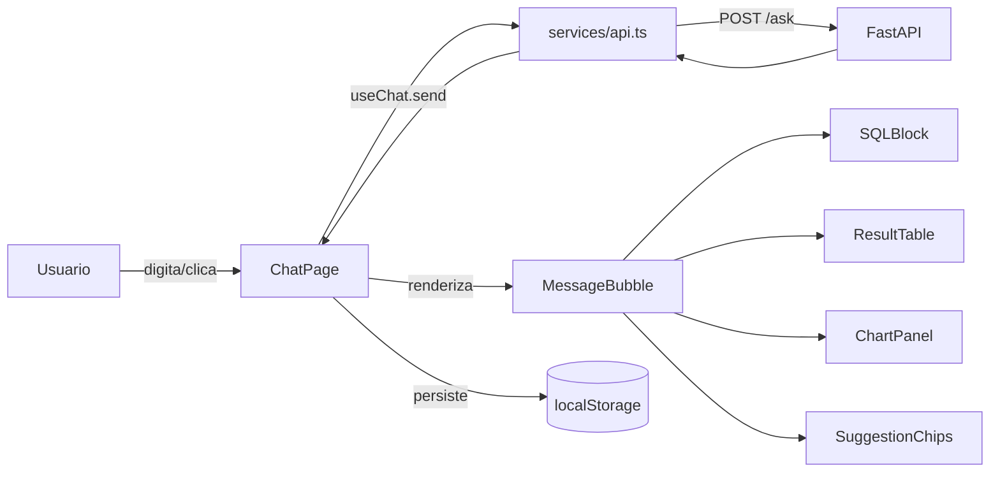
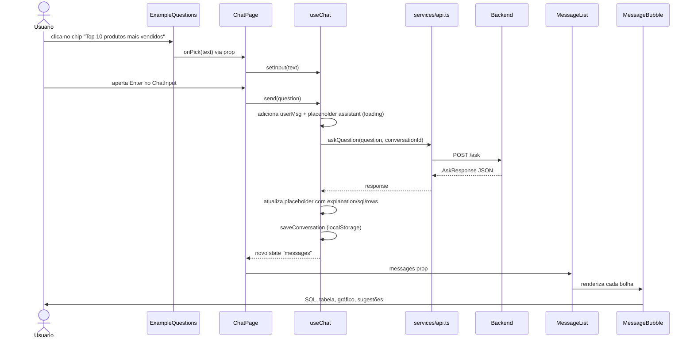
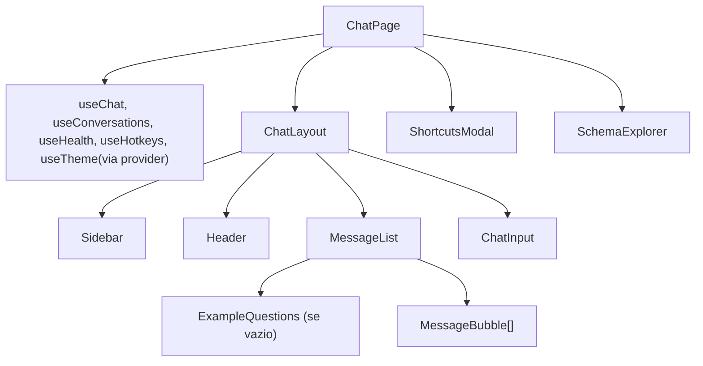
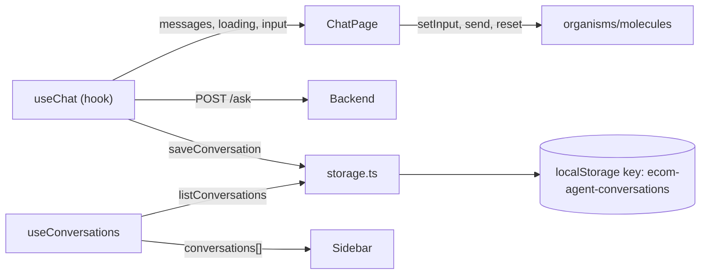
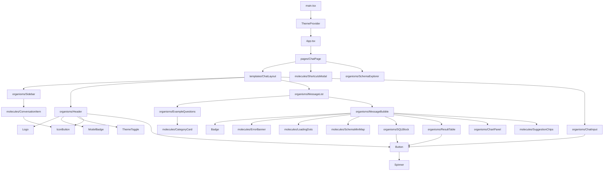

# Explicação Detalhada do Frontend

> Guia pedagógico para entender **cada pasta, cada arquivo e cada hook** do
> frontend sem precisar abrir o código. Cada seção explica o propósito,
> como interage com as outras partes, e como testar isoladamente.

---

## Sumário

1. [Visão geral em 30 segundos](#1-visão-geral-em-30-segundos)
2. [Stack e por que cada escolha](#2-stack-e-por-que-cada-escolha)
3. [Anatomia do projeto](#3-anatomia-do-projeto)
4. [Fluxo de uma pergunta (UI)](#4-fluxo-de-uma-pergunta-ui)
5. [Componentes um a um (Atomic Design)](#5-componentes-um-a-um-atomic-design)
6. [Hooks, services, lib, types, pages](#6-hooks-services-lib-types-pages)
7. [Estado e persistência](#7-estado-e-persistência)
8. [UX e produtividade](#8-ux-e-produtividade)
9. [Como estender](#9-como-estender)

---

## 1) Visão geral em 30 segundos

O frontend é uma **SPA React** que conversa com o backend FastAPI via HTTP.
A tela principal é um chat: você digita uma pergunta em português, o agente
gera SQL, executa no banco e devolve dados + explicação. A UI mostra tudo
em três camadas: a **bolha** com a explicação, o **bloco SQL** colapsável
(editável) e a **tabela** de resultados (com gráfico e download CSV).



**Em resumo:** React orquestra a UI, hooks controlam estado, services
isolam I/O (HTTP e localStorage), components renderizam.

---

## 2) Stack e por que cada escolha

| Tecnologia | Versão | Por quê |
|---|---|---|
| **React** | 19.2 | Biblioteca de UI mais popular; hooks ótimos para estado local. |
| **Vite** | 8.0 | Bundler moderno, HMR rápido; dev server sobe em ~200ms. |
| **TypeScript** | 6.0 | Tipagem estrita — o projeto tem **zero `any`**. Detecta bugs em build. |
| **Tailwind CSS** | 3.4 | Utility-first; permite UI polida sem CSS proprietário. |
| **recharts** | 3.8 | Gráficos (Bar/Line/Pie) sobre React; API declarativa. |
| **uuid** | 14.0 | Gera IDs únicos (conversation_id, message.id). |
| **pnpm** | 10.33 | Gerenciador de pacotes mais eficiente em cache que npm/yarn. |

**Nada de Redux, zustand, react-query:** o estado do chat é local à
`ChatPage` via hooks; caché de conversas fica no `localStorage`; não há
complexidade que justifique bibliotecas de estado global.

**Por que Atomic Design?** Componentes pequenos e específicos (atoms)
compõem moléculas, que compõem organismos, que moram num template, que é
usado em páginas. Isso dá reuso e clareza de responsabilidade.

---

## 3) Anatomia do projeto

```
Atividade-GenAI/frontend/
├── index.html                  # shell HTML, lang=pt-BR, Inter via Google Fonts
├── vite.config.ts              # config minimalista (plugin-react)
├── tailwind.config.js          # paleta brand (verde), animations, shadows
├── tsconfig.*.json             # TypeScript estrito em 3 arquivos
├── eslint.config.js            # eslint + react-hooks + react-refresh
├── package.json                # deps + scripts (dev/build/lint/preview)
├── public/
│   ├── favicon.svg             # favicon verde
│   └── icons.svg               # sprite SVG (ícones auxiliares)
└── src/
    ├── main.tsx                # bootstrap: ThemeProvider + App
    ├── App.tsx                 # apenas renderiza ChatPage
    ├── index.css               # @tailwind + scrollbar-soft + body gradient
    ├── pages/
    │   └── ChatPage.tsx        # orquestra hooks + template + modais
    ├── components/
    │   ├── atoms/              # 7 peças minimas (Button, Badge, IconButton...)
    │   ├── molecules/          # 7 componentes compostos
    │   ├── organisms/          # 10 blocos grandes (Header, Sidebar, ChatInput...)
    │   └── templates/
    │       └── ChatLayout.tsx  # grid/flex do layout principal
    ├── hooks/                  # useChat, useConversations, useHealth, useHotkeys, useTheme
    ├── services/               # api.ts (HTTP) + storage.ts (localStorage)
    ├── lib/                    # csv.ts, dateGroups.ts, markdown.ts (utilidades puras)
    └── types/
        └── index.ts            # contratos TS espelhando a API
```

> **Regra de ouro:** **estado mora em pages/hooks.** Organisms e templates
> recebem dados e callbacks via props — nunca conhecem `localStorage` nem
> `fetch` diretamente.

---

## 4) Fluxo de uma pergunta (UI)

Vamos seguir **"Top 10 produtos mais vendidos"** desde o clique no chip de
exemplo até a tabela renderizada.



### Passo a passo com arquivo:linha

1. **Clique no chip** — `ExampleQuestions.onPick(text)` é chamado
   ([ExampleQuestions.tsx:173](Atividade-GenAI/frontend/src/components/organisms/ExampleQuestions.tsx)).
2. **Prop sobe até ChatPage** — `onExamplePick={setInput}` em
   [ChatPage.tsx:141](Atividade-GenAI/frontend/src/pages/ChatPage.tsx).
   `input` passa a ser o texto selecionado.
3. **Usuário pressiona Enter** — `ChatInput` detecta key `Enter` sem Shift e
   chama `onSend(question)` em
   [ChatInput.tsx:28](Atividade-GenAI/frontend/src/components/organisms/ChatInput.tsx).
4. **`useChat.send` assume o controle**
   ([useChat.ts:39](Atividade-GenAI/frontend/src/hooks/useChat.ts)):
   - Adiciona `userMsg` + placeholder `assistantPlaceholder { loading: true }`.
   - Limpa o input, seta `loading=true`.
   - Chama `askQuestion(trimmed, conversationId)`.
5. **`services/api.ts`** faz `POST /ask`
   ([api.ts:26](Atividade-GenAI/frontend/src/services/api.ts)).
6. **Backend processa** (ver [ExplicacaoBackend.md](ExplicacaoBackend.md)) e
   devolve `AskResponse` com sql/columns/rows/explanation/suggestions/...
7. **`useChat` atualiza a mensagem placeholder** com a resposta completa e
   persiste a conversa em `localStorage` via
   [storage.ts:32](Atividade-GenAI/frontend/src/services/storage.ts).
8. **`MessageList` recebe o novo `messages[]`** e renderiza cada item como
   `MessageBubble`
   ([MessageList.tsx:38](Atividade-GenAI/frontend/src/components/organisms/MessageList.tsx)).
9. **`MessageBubble` compõe o resultado**: `SchemaMiniMap` (RAG), `SQLBlock`
   (colapsável/editável), `ResultTable`, `ChartPanel`, `SuggestionChips`.
10. **Usuário vê a resposta** — com opção de clicar numa sugestão para
    continuar a conversa.

> **Dica — follow-ups:** o `conversation_id` é gerado no cliente via
> `uuid.v4()` ao carregar a página e só muda em "Nova conversa". O backend
> mantém o histórico naquele id para follow-ups funcionarem ("e no estado
> de SP?").

---

## 5) Componentes um a um (Atomic Design)

### Atoms (7) — peças mínimas reutilizáveis

| Componente | O que faz |
|---|---|
| [Button](Atividade-GenAI/frontend/src/components/atoms/Button.tsx) | 4 variants (`primary`, `secondary`, `ghost`, `danger`), 3 tamanhos, com `loading` (troca children por spinner), ícones L/R, `fullWidth`. |
| [IconButton](Atividade-GenAI/frontend/src/components/atoms/IconButton.tsx) | Botão quadrado para ícones; 3 tones × 2 tamanhos. Usado em toggles, delete, etc. |
| [Badge](Atividade-GenAI/frontend/src/components/atoms/Badge.tsx) | Pílula pequena (`neutral`, `brand`, `amber`, `rose`) — ex: "Em cache", "PK", "NOT NULL". |
| [Spinner](Atividade-GenAI/frontend/src/components/atoms/Spinner.tsx) | SVG animate-spin, só estilo; consumido pelo `Button` e `LoadingDots`. |
| [Logo](Atividade-GenAI/frontend/src/components/atoms/Logo.tsx) | Marca com gradiente verde + ícone de folha/chat. |
| [ModelBadge](Atividade-GenAI/frontend/src/components/atoms/ModelBadge.tsx) | Chip que mostra o modelo Gemini em uso (ou "Backend offline"). |
| [ThemeToggle](Atividade-GenAI/frontend/src/components/atoms/ThemeToggle.tsx) | Botão sol/lua que alterna o tema via `useTheme`. |

### Molecules (7) — composições simples

| Componente | O que faz |
|---|---|
| [CategoryCard](Atividade-GenAI/frontend/src/components/molecules/CategoryCard.tsx) | Card de categoria com ícone + lista de perguntas clicáveis (usado em `ExampleQuestions`). |
| [ConversationItem](Atividade-GenAI/frontend/src/components/molecules/ConversationItem.tsx) | Linha do histórico: título + data + botões renomear/excluir; single-click abre, double-click renomeia. |
| [ErrorBanner](Atividade-GenAI/frontend/src/components/molecules/ErrorBanner.tsx) | Banner rosa com ícone, usado quando o `/ask` falha. |
| [LoadingDots](Atividade-GenAI/frontend/src/components/molecules/LoadingDots.tsx) | 3 bolinhas bouncing + mensagem rotativa ("Analisando…", "Gerando SQL…", etc a cada 1.4s). |
| [SchemaMiniMap](Atividade-GenAI/frontend/src/components/molecules/SchemaMiniMap.tsx) | Chips das 7 tabelas; destaca as que o RAG selecionou e mostra "-XX% tokens". Clicar abre o Schema Explorer focado. |
| [ShortcutsModal](Atividade-GenAI/frontend/src/components/molecules/ShortcutsModal.tsx) | Modal com tabela de atalhos (`?`, `Ctrl+B`, `Ctrl+/`, `Ctrl+K`, `Esc`). |
| [SuggestionChips](Atividade-GenAI/frontend/src/components/molecules/SuggestionChips.tsx) | Chips "Continue explorando" (até 3 follow-ups sugeridos pelo agente). |

### Organisms (10) — blocos principais

| Componente | O que faz |
|---|---|
| [Header](Atividade-GenAI/frontend/src/components/organisms/Header.tsx) | Topo sticky: Logo + título + ModelBadge + status online + ThemeToggle + botões (Schema Explorer, Atalhos, Exportar .md, Nova conversa). |
| [Sidebar](Atividade-GenAI/frontend/src/components/organisms/Sidebar.tsx) | Drawer esquerdo com histórico de conversas agrupado por data (`Hoje`, `Ontem`, `Últimos 7 dias`...), busca por título, lista de tabelas do banco. |
| [ChatInput](Atividade-GenAI/frontend/src/components/organisms/ChatInput.tsx) | Textarea auto-expansivel (até 200px) + botão Enviar. Enter envia; Shift+Enter quebra linha. |
| [MessageList](Atividade-GenAI/frontend/src/components/organisms/MessageList.tsx) | Scroller com a lista de bolhas; auto-scroll para o fim a cada nova mensagem. Se `messages` vazio, mostra `ExampleQuestions`. |
| [MessageBubble](Atividade-GenAI/frontend/src/components/organisms/MessageBubble.tsx) | A bolha (user vs assistant). Assistant mostra badges (cache/manualmente editada/duração), SchemaMiniMap, explicação, SQLBlock, ResultTable, ChartPanel, SuggestionChips. |
| [ExampleQuestions](Atividade-GenAI/frontend/src/components/organisms/ExampleQuestions.tsx) | Tela inicial com hero + grid de 5 `CategoryCard` × 2 perguntas cada (as 10 canônicas). |
| [SQLBlock](Atividade-GenAI/frontend/src/components/organisms/SQLBlock.tsx) | Bloco colapsável com o SQL gerado; botões Copiar e Editar. No modo edição, permite reexecutar a SQL via `POST /execute-sql` e atualizar a mesma bolha. |
| [ResultTable](Atividade-GenAI/frontend/src/components/organisms/ResultTable.tsx) | Tabela de resultados com scroll interno, header sticky, zebra rows, botão "Baixar CSV" (UTF-8 BOM, separador `;`). |
| [ChartPanel](Atividade-GenAI/frontend/src/components/organisms/ChartPanel.tsx) | Renderiza automaticamente Bar/Line/Pie quando o resultado tem 2 colunas e a 2ª é ≥80% numérica; 3 botões para alternar o tipo de gráfico. Tema claro/escuro aplicado. |
| [SchemaExplorer](Atividade-GenAI/frontend/src/components/organisms/SchemaExplorer.tsx) | Drawer direito com introspecção do banco: linhas por tabela, colunas (tipo, PK, NOT NULL), top-values das categóricas em barras, min/avg/max das numéricas, amostra, FKs lógicas clicáveis, botão "Inserir exemplo". |

### Templates (1)

- [ChatLayout](Atividade-GenAI/frontend/src/components/templates/ChatLayout.tsx)
  — flex vertical `h-screen`, injeta `sidebar`, `header`, `messages`, `input`
  sem conhecer nenhum detalhe de negócio.

---

## 6) Hooks, services, lib, types, pages

### Hooks (5)

| Hook | Responsabilidade |
|---|---|
| [useChat](Atividade-GenAI/frontend/src/hooks/useChat.ts) | Gerencia `conversationId`, `messages`, `input`, `loading`. Expõe `send`, `reset`, `resetLocal`, `reexecuteSql`, `openConversation`, `removeConversation`, `renameConversation`. Único lugar que fala com `services/api` e `services/storage` pelo chat. |
| [useConversations](Atividade-GenAI/frontend/src/hooks/useConversations.ts) | Lê a lista de conversas do `localStorage` e expõe `refresh` + `clearAll`. |
| [useHealth](Atividade-GenAI/frontend/src/hooks/useHealth.ts) | Faz `GET /health` na montagem; expõe `model`, `online`, `tables`, `schema`, `loading`. Nunca refaz. |
| [useHotkeys](Atividade-GenAI/frontend/src/hooks/useHotkeys.ts) | Registra listener global de teclado. Ignora quando foco está em `input/textarea/select/contentEditable`, exceto `Escape` (sempre tratado). |
| [useTheme](Atividade-GenAI/frontend/src/hooks/useTheme.tsx) | Context provider `ThemeProvider` + hook `useTheme`. Persiste em `ecom-agent-theme`. Padrão inicial: `prefers-color-scheme`. |

### Services (2)

| Service | Responsabilidade |
|---|---|
| [api.ts](Atividade-GenAI/frontend/src/services/api.ts) | `askQuestion`, `executeSql`, `rehydrateConversation`, `resetConversation`, `getHealth`, `checkHealth` + classe `ApiError`. `API_BASE` configurável via `VITE_API_BASE`. |
| [storage.ts](Atividade-GenAI/frontend/src/services/storage.ts) | `listConversations`, `saveConversation`, `deleteConversation`, `deleteAllConversations`. Chave: `ecom-agent-conversations`. Cap em 50 registros, ordenados por `createdAt` desc. |

### Lib (3) — utilitários puros

| Arquivo | Função |
|---|---|
| [csv.ts](Atividade-GenAI/frontend/src/lib/csv.ts) | `toCsv(cols, rows)` (separador `;`, escape RFC4180) + `downloadCsv` (UTF-8 com BOM para abrir direto no Excel). |
| [markdown.ts](Atividade-GenAI/frontend/src/lib/markdown.ts) | `toMarkdown(conv)` converte uma conversa em `.md` (títulos, SQL em code fence, tabela de até 20 linhas, nota de linhas adicionais) + `downloadMarkdown`. |
| [dateGroups.ts](Atividade-GenAI/frontend/src/lib/dateGroups.ts) | `groupByDate(items)` retorna buckets `Hoje / Ontem / Últimos 7 dias / Últimos 30 dias / Mais antigas` para o histórico do sidebar. |

### Types (1)

- [types/index.ts](Atividade-GenAI/frontend/src/types/index.ts) — contratos
  TypeScript espelhando a API do backend: `AskRequest/AskResponse`,
  `ExecuteSqlRequest/Response`, `Message` (union user/assistant),
  `ConversationRecord` (persistido), `SchemaSnapshot`, `TableInfo`,
  `ColumnInfo`, `LogicalFk`, `HealthResponse`, `ExampleCategory`.

### Pages (1)

- [ChatPage](Atividade-GenAI/frontend/src/pages/ChatPage.tsx) — a única
  "página". Composta assim:



Responsabilidades da `ChatPage`:

- Estado local de **drawers/modais** (`sidebarOpen`, `showShortcuts`,
  `schemaOpen`, `schemaFocusTable`).
- Conecta os hooks aos organismos.
- Define a prioridade do Escape: **modal → schema → sidebar**
  (`handleEscape`).
- Orquestra `handleExport` (pega a conversa atual e gera `.md`) e
  `handleClearAll` (limpa localStorage + cria nova conversa).

---

## 7) Estado e persistência

### Fluxo de estado do chat



### localStorage: duas chaves

1. `ecom-agent-conversations` — array de `ConversationRecord`. Cada record
   tem `id`, `title` (auto a partir da 1ª pergunta, ou override), `titleOverride`,
   `createdAt`, `messages[]` e `messagesJson` (para rehydrate).
2. `ecom-agent-theme` — string `"light"` ou `"dark"`.

> **Cap em 50 conversas**: ao passar disso, `writeAll` corta pelas mais
> antigas (`createdAt` desc). Evita estourar cota do `localStorage`
> (~5 MB).

### Por que `messagesJson`?

O backend serializa o histórico do Pydantic AI com `ModelMessagesTypeAdapter`.
Guardamos essa string opaca junto da conversa para conseguir **rehydrate**:
quando o usuário reabre uma conversa antiga, o cliente faz
`POST /rehydrate` para repopular a memória do backend sem gastar chamadas
ao Gemini. Isso permite fazer follow-ups em conversas salvas.

---

## 8) UX e produtividade

### Atalhos de teclado

| Tecla | Ação |
|---|---|
| `Ctrl`+`B` | Abrir/fechar sidebar de histórico |
| `Ctrl`+`/` | Nova conversa |
| `Ctrl`+`K` | Abrir Schema Explorer |
| `?` | Abrir modal de atalhos |
| `Esc` | Fechar (prioridade: modal → schema → sidebar) |

No Mac, `⌘` substitui `Ctrl`. Todos os atalhos são ignorados quando o foco
está em input/textarea (exceto `Esc`).

### Tema claro/escuro

- **Padrão**: `prefers-color-scheme` do SO.
- **Override manual**: botão sol/lua no header; salva em `ecom-agent-theme`.
- **Dark mode** aplicado via classe `dark` no `<html>`; Tailwind usa
  `darkMode: "class"` (`tailwind.config.js:3`).
- **Paleta brand** (verde emerald) tem 11 tons (`50` → `950`) com versões
  dark para cada contexto.

### Export Markdown

Botão "Exportar .md" no Header ([handleExport em ChatPage.tsx:88](Atividade-GenAI/frontend/src/pages/ChatPage.tsx)):
pega a conversa atual, chama `toMarkdown`, baixa o arquivo nomeado pelo
título (sanitizado por `safeExportFilename`).

### Download CSV

Botão "Baixar CSV" no `ResultTable`: gera UTF-8 BOM (para Excel abrir com
acentos corretos), separador `;`, escape de aspas/quebras conforme RFC4180.

### Schema Explorer

`Ctrl+K` ou botão no Header abre drawer lateral direito com dados reais do
SQLite via `GET /health` → `SchemaSnapshot`:
- linhas por tabela,
- colunas (tipo, PK, NOT NULL),
- top-5 valores das categóricas em barra,
- min/avg/max das numéricas,
- amostra de 3 linhas,
- FKs lógicas clicáveis (pulam para a tabela destino),
- botão "Inserir exemplo" (insere pergunta gerada no chat).

### SchemaMiniMap (RAG)

Bolha de resposta mostra quais tabelas o retriever RAG selecionou. Clicar
num chip abre o Schema Explorer focando naquela tabela. Um badge
`-XX% tokens (~YYY)` aparece quando o RAG economizou tokens no system
prompt.

### SQL editável

No bloco SQL de cada resposta, botão "Editar" permite alterar a query e
reexecutar via `POST /execute-sql` (sem chamar o LLM). A bolha é marcada
com badge `SQL reexecutada manualmente`.

---

## 9) Como estender

### 9.1 Adicionar um novo atom

Crie `src/components/atoms/MeuAtom.tsx`. Mantenha:
- apenas props simples,
- zero estado global,
- respeita paleta `brand-*`,
- exporta função nomeada (não default).

### 9.2 Adicionar uma nova rota no backend

Passo a passo para consumir uma nova rota `POST /xyz`:
1. Em [services/api.ts](Atividade-GenAI/frontend/src/services/api.ts),
   adicione `export async function xyz(...)` que chama `fetch` e lança
   `ApiError` em caso de `!res.ok`.
2. Em [types/index.ts](Atividade-GenAI/frontend/src/types/index.ts),
   adicione `XyzRequest` e `XyzResponse`.
3. Se for chamado do chat, adicione o método ao hook
   [useChat](Atividade-GenAI/frontend/src/hooks/useChat.ts); caso
   contrário, crie um hook novo em `hooks/`.
4. Passe o novo método como prop ao organismo que vai exibir o resultado.

### 9.3 Adicionar um novo tipo de gráfico

Em [ChartPanel.tsx](Atividade-GenAI/frontend/src/components/organisms/ChartPanel.tsx):
1. Adicione o slug ao union `type ChartType`.
2. Adicione um `IconButton` no toolbar setando `setChartType`.
3. Adicione um bloco `{chartType === "novo" && (<SeuChart .../>)}` dentro do
   `ResponsiveContainer`.

### 9.4 Trocar a URL do backend

Defina `VITE_API_BASE=http://seu-host:porta` antes do `pnpm dev`, ou edite
`API_BASE` em
[services/api.ts](Atividade-GenAI/frontend/src/services/api.ts).

### 9.5 Ajustar a paleta

Edite `theme.extend.colors.brand` em
[tailwind.config.js](Atividade-GenAI/frontend/tailwind.config.js). Todas as
classes `brand-*` vão trocar automaticamente. O gradiente do `body` em
[index.css](Atividade-GenAI/frontend/src/index.css) também usa tons verdes
— atualize lá se quiser mudar o fundo.

---

## Apêndice: hierarquia Atomic Design completa



---

> **Pronto.** Próximos passos sugeridos:
> - rodar `pnpm dev` no `frontend/` + `uvicorn app.main:app` no `backend/`
>   (ver [ComoRodar.md](ComoRodar.md));
> - ler [ExplicacaoBackend.md](ExplicacaoBackend.md) para entender o lado
>   que essa UI consome.
